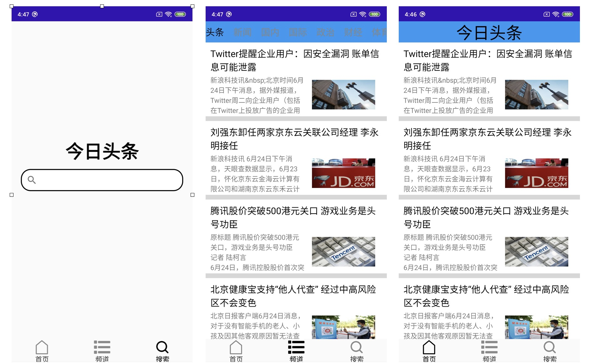

# README
This is a demo of "News App", which is complete in Tencent during my summer internship as a practice project. In this project, I simply implement the function of news app, where contains "HeadLine", "Channels" 
and "Search" function. The data of this app is request form [here](https://www.jisuapi.com/api/news/), and I just simply get and show those data.

## Preview
